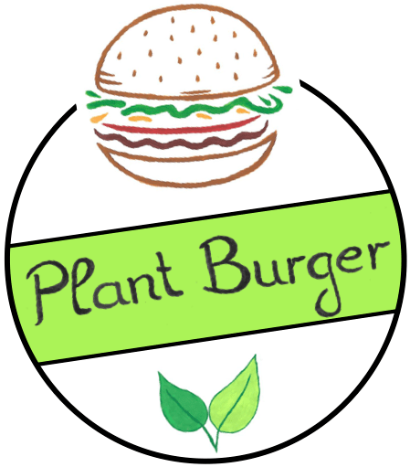

# Plant-Burger Website

<p align="center">
    
</p>

Made with Next.js (SSG)  
Deploys to Vercel  
DatoCMS

## Getting Started

First, run the development server:

```bash
npm install
npm run dev
```

Open [http://localhost:3000](http://localhost:3000) with your browser to see the result.

## Tech-Stack

Take a look at package.json for now.
